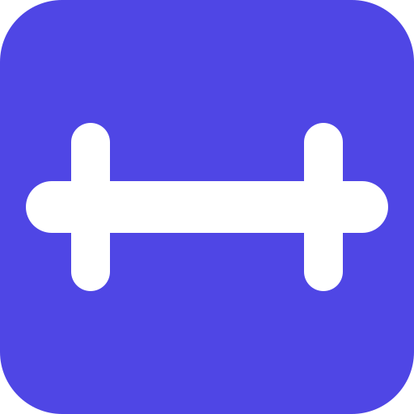

# 💪 FitTracker

I built FitTracker because I couldn't find a decent app for my workouts. Everything on the market was either filled with annoying ads or just way too overcomplicated for what I needed. 

This project is 100% *vibe-coded*. I didn't check or even look at the code at all during development. The entire process was a continuous loop of: **prompt -> check the app -> prompt**.

---

### Key Features
- **Exercise Tracking:** Count reps for Push-ups, Squats, and Crunches.
- **Analytics:** Weekly progress charts with pagination.
- **Streaks:** Current and best streaks per exercise.
- **Audio Feedback:** Sounds for reps and rest completion.
- **Wake Lock:** Prevents screen from sleeping during workouts.
- **Theme:** Follows system light/dark mode.
- **Offline Mode:** Works as a PWA without internet.
